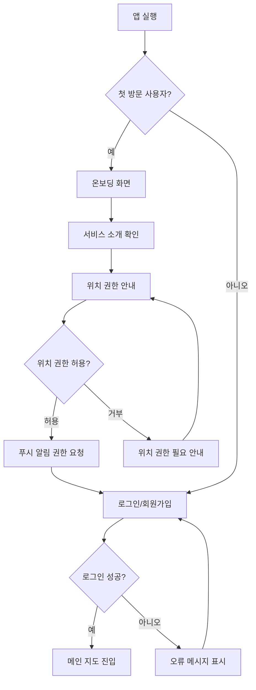
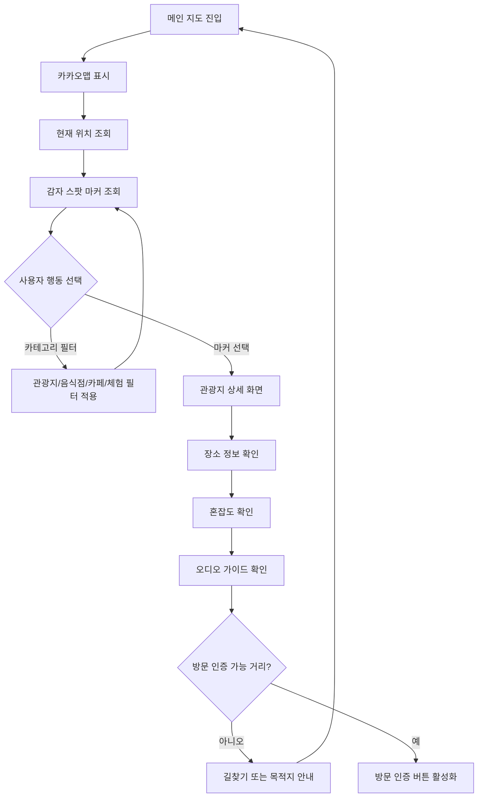
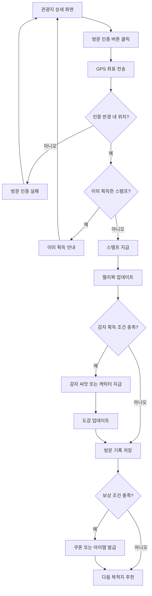
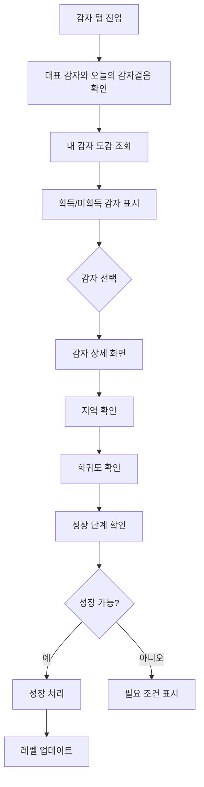
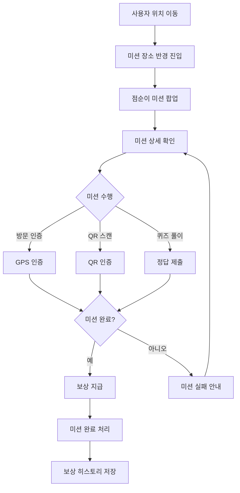
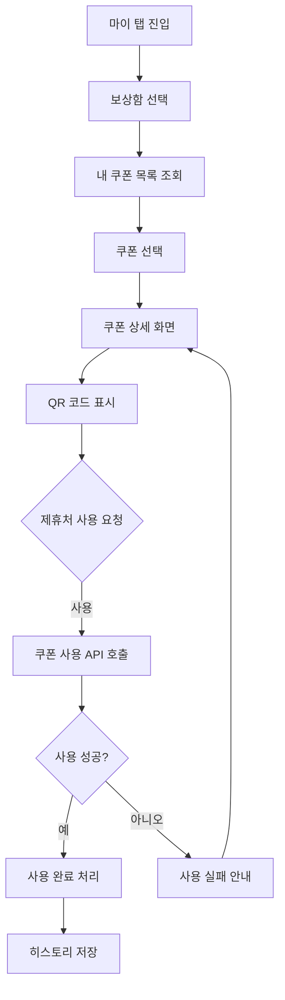

# 04_user_flow.md

# 사용자 플로우

## 1. 온보딩 및 로그인 플로우

```mermaid
flowchart TD
    A[앱 실행] --> B{첫 방문 사용자?}
    B -- 예 --> C[온보딩 화면]
    C --> D[서비스 소개 확인]
    D --> E[위치 권한 안내]
    E --> F{위치 권한 허용?}
    F -- 허용 --> G[푸시 알림 권한 요청]
    F -- 거부 --> F1[위치 권한 필요 안내]
    F1 --> E
    G --> H[로그인/회원가입]
    B -- 아니오 --> H
    H --> I{로그인 성공?}
    I -- 예 --> J[메인 지도 진입]
    I -- 아니오 --> K[오류 메시지 표시]
    K --> H
```

## 2. 감자 지도 탐색 플로우

```mermaid
flowchart TD
    A[메인 지도 진입] --> B[카카오맵 표시]
    B --> C[현재 위치 조회]
    C --> D[감자 스팟 마커 조회]
    D --> E{사용자 행동 선택}

    E -- 카테고리 필터 --> F[관광지/음식점/카페/체험 필터 적용]
    F --> D

    E -- 마커 선택 --> G[관광지 상세 화면]
    G --> H[장소 정보 확인]
    H --> I[혼잡도 확인]
    I --> J[오디오 가이드 확인]
    J --> K{방문 인증 가능 거리?}

    K -- 아니오 --> L[길찾기 또는 목적지 안내]
    L --> A

    K -- 예 --> M[방문 인증 버튼 활성화]
```

## 3. 스탬프 획득 플로우

```mermaid
flowchart TD
    A[관광지 상세 화면] --> B[방문 인증 버튼 클릭]
    B --> C[GPS 좌표 전송]
    C --> D{인증 반경 내 위치?}

    D -- 아니오 --> E[방문 인증 실패]
    E --> A

    D -- 예 --> F{이미 획득한 스탬프?}
    F -- 예 --> G[이미 획득 안내]
    G --> A

    F -- 아니오 --> H[스탬프 지급]
    H --> I[랠리북 업데이트]
    I --> J{감자 획득 조건 충족?}

    J -- 예 --> K[감자 씨앗 또는 캐릭터 지급]
    K --> L[도감 업데이트]

    J -- 아니오 --> M[방문 기록 저장]
    L --> M

    M --> N{보상 조건 충족?}
    N -- 예 --> O[쿠폰 또는 아이템 발급]
    N -- 아니오 --> P[다음 목적지 추천]
    O --> P
```

## 4. 감자 플로우

```mermaid
flowchart TD
    A[감자 탭 진입] --> B[대표 감자와 오늘의 감자걸음 확인]
    B --> C[내 감자 도감 조회]
    C --> D[획득/미획득 감자 표시]
    D --> E{감자 선택}

    E --> F[감자 상세 화면]
    F --> G[지역 확인]
    G --> H[희귀도 확인]
    H --> I[성장 단계 확인]
    I --> J{성장 가능?}

    J -- 예 --> K[성장 처리]
    K --> L[레벨 업데이트]

    J -- 아니오 --> M[필요 조건 표시]
```

## 5. 점순이 미션 플로우

```mermaid
flowchart TD
    A[사용자 위치 이동] --> B[미션 장소 반경 진입]
    B --> C[점순이 미션 팝업]
    C --> D[미션 상세 확인]
    D --> E{미션 수행}

    E -- 방문 인증 --> F[GPS 인증]
    E -- QR 스캔 --> G[QR 인증]
    E -- 퀴즈 풀이 --> H[정답 제출]

    F --> I{미션 완료?}
    G --> I
    H --> I

    I -- 예 --> J[보상 지급]
    J --> K[미션 완료 처리]
    K --> L[보상 히스토리 저장]

    I -- 아니오 --> M[미션 실패 안내]
    M --> D
```

## 6. 마이페이지 보상함 플로우

```mermaid
flowchart TD
    A[마이 탭 진입] --> B[보상함 선택]
    B --> C[내 쿠폰 목록 조회]
    C --> D[쿠폰 선택]
    D --> E[쿠폰 상세 화면]
    E --> F[QR 코드 표시]
    F --> G{제휴처 사용 요청}

    G -- 사용 --> H[쿠폰 사용 API 호출]
    H --> I{사용 성공?}

    I -- 예 --> J[사용 완료 처리]
    J --> K[히스토리 저장]

    I -- 아니오 --> L[사용 실패 안내]
    L --> E
```
